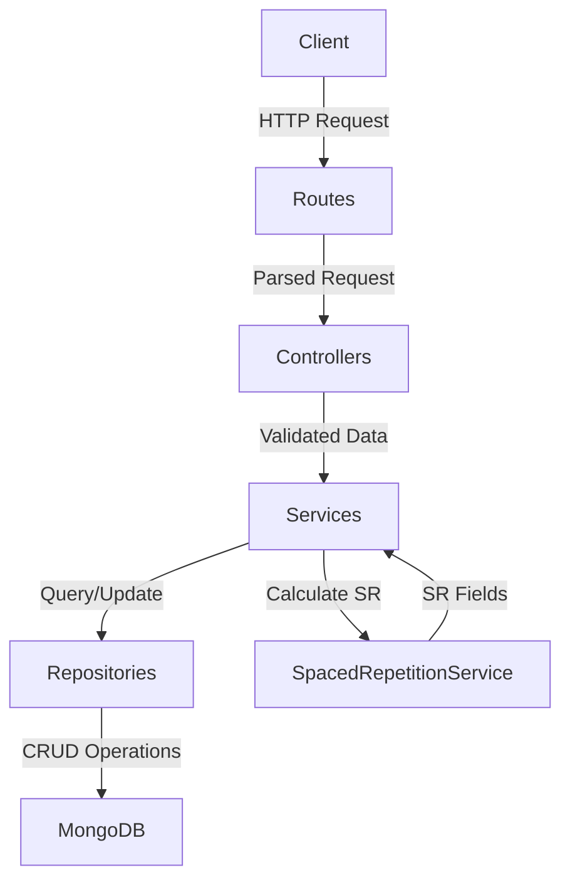
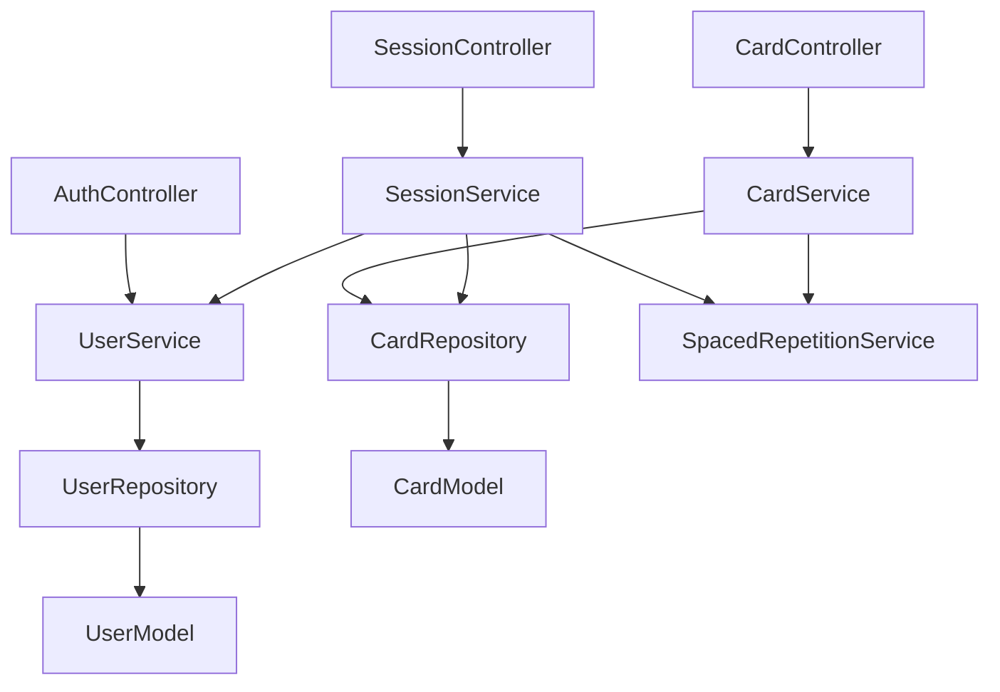
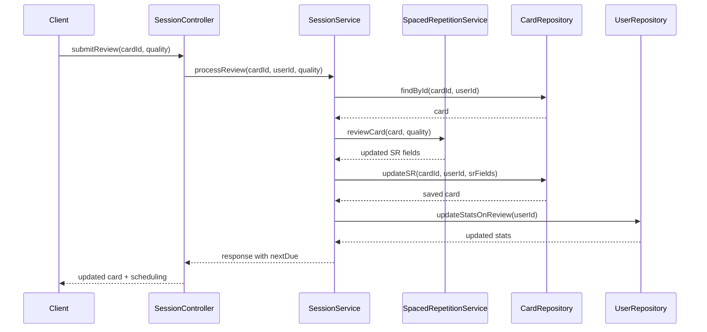

# DSA Flashcard Backend

## Product Overview

This application is a backend system for a DSA (Data Structures & Algorithms) learning platform.

It allows users to:
- Create and manage structured flashcards for coding problems
- Store multiple solutions per problem (from brute force → optimal)
- Practice using spaced repetition to improve long-term retention
- Track learning progress, streaks, and review history

Each flashcard is not just a question-answer pair, but a **learning unit**:
- A problem (e.g., "Two Sum")
- Multiple solution approaches (intuition, steps, code, complexity)
- A learning state powered by a spaced repetition algorithm (SM-2)

The system automatically schedules revision sessions based on user performance (easy/medium/hard),
ensuring efficient and personalized learning over time.

## Architecture Overview

The system follows a layered architecture:

Routes → Controllers → Services → Repositories → Database

Each layer has a single responsibility:
- **Routes**: define endpoints and URL structure
- **Controllers**: handle request/response, validation, authentication
- **Services**: business logic, orchestration, no HTTP/DB specifics
- **Repositories**: pure database access, no business logic
- **Database**: MongoDB with Mongoose ODM

The architecture is designed to separate learning logic (spaced repetition, session generation)
from infrastructure (HTTP, database), making the system scalable and testable.

## Request Flow



## Project Structure

```
src/
├── config/
│   ├── constants.js          # SR algorithm constants, JWT config
│   └── database.js           # MongoDB connection setup
├── controllers/
│   ├── AuthController.js     # User auth, profile, stats
│   ├── CardController.js     # Card CRUD, solution management
│   └── SessionController.js  # Session management, review submission
├── middleware/
│   ├── auth.js               # JWT authentication
│   └── errorHandler.js       # Centralized error handling
├── models/
│   ├── User.js               # User schema (identity, preferences, stats)
│   └── Card.js               # Card schema (content, solutions, SR fields)
├── repositories/
│   ├── UserRepository.js     # User data access
│   └── CardRepository.js     # Card data access, due card queries
├── routes/
│   ├── auth.js               # Auth endpoints
│   ├── cards.js              # Card endpoints
│   └── sessions.js           # Session endpoints
├── services/
│   ├── UserService.js        # User business logic, auth, streak calculation
│   ├── CardService.js        # Card business logic, validation
│   ├── SessionService.js     # Session orchestration, review processing
│   └── SpacedRepetitionService.js  # SM-2 algorithm implementation
└── app.js                    # Express app setup
```

## Core Modules



## Session Flow (Spaced Repetition)



## Models

### User
**Purpose**: Identity, preferences, and aggregate learning state

**Fields**:
- `email`: Unique identifier
- `passwordHash`: Bcrypt-hashed password
- `name`: Display name
- `avatarUrl`: Profile picture
- `preferences`: User settings (dailyGoal, maxSessionSize, preferredCategories)
- `stats`: Learning statistics (totalReviews, streak, lastActiveDate)

**Key Design**: User stores only aggregate stats, not per-card learning state. Card-specific SR data lives in Card model.

### Card
**Purpose**: Learning content + spaced repetition state

**Fields**:
- `userId`: Owner reference (data isolation)
- `questionName`: Problem title
- `category`: Problem category (Array, String, DP, etc.)
- `difficulty`: Overall difficulty (easy, medium, hard)
- `tags`: Searchable tags
- `solutions[]`: Ordered array of solution approaches
  - `name`: Solution name (e.g., "Brute Force", "Optimal Sliding Window")
  - `approachOrder`: Explicit ordering (0, 1, 2...)
  - `intuition`: Why this approach works
  - `steps[]`: Step-by-step explanation
  - `code`: Code snippet with language
  - `timeComplexity`: Time complexity notation
  - `spaceComplexity`: Space complexity notation
- `selectedSolutionIndex`: Currently studied solution
- `revisionNotes`: User-added insights
- `easeFactor`: SM-2 ease factor (default 2.5, min 1.3)
- `interval`: Days until next review
- `repetition`: Number of successful reviews
- `dueDate`: When card is due for review
- `lastReviewed`: Last review timestamp
- `lastQuality`: Quality score of last review (1-5)
- `lapseCount`: Number of times quality < 3

**Key Design**: Solutions are immutable knowledge, SR fields are mutable learning state. This separation allows updating problem content without affecting learning progress.

## Implementation Mapping

- **Controllers**: `src/controllers/*` - Request/response handling, validation
- **Services**: `src/services/*` - Business logic, SR algorithm, orchestration
- **Repositories**: `src/repositories/*` - Database access, queries, atomic operations
- **Models**: `src/models/*` - Mongoose schemas, validation, indexes
- **Routes**: `src/routes/*` - Endpoint definitions, middleware composition
- **Middleware**: `src/middleware/*` - Cross-cutting concerns (auth, error handling)
- **Config**: `src/config/*` - Constants, environment setup, DB connection

## Key Design Decisions

### Separation of Concerns
- **User** = identity + meta (preferences, aggregate stats)
- **Card** = learning + SR (per-card scheduling)
- This separation allows updating user profile without affecting learning progress

### Spaced Repetition Isolation
- **SpacedRepetitionService** is a pure function service
- No HTTP or database dependencies
- Easy to test and modify algorithm independently

### Data Isolation
- All repository queries include `userId` for multi-tenant safety
- No cross-user data access possible at database level
- Compound indexes optimize common queries

### Testability
- Unit tests mock repositories, test business logic only
- Integration tests use real MongoDB Memory Server
- E2E tests verify complete user journeys
- ~70% unit, ~25% integration, ~5% e2e distribution

## API Endpoints

### Authentication (`/api/auth`)
- `POST /register` - Create new user
- `POST /login` - Authenticate and get JWT token
- `GET /profile` - Get current user profile
- `PUT /profile` - Update user profile
- `GET /stats` - Get user learning statistics

### Cards (`/api/cards`)
- `POST /` - Create new flashcard
- `GET /` - List cards with filters (category, difficulty, tags, pagination)
- `GET /:cardId` - Get single card
- `PUT /:cardId` - Update card content
- `DELETE /:cardId` - Delete card
- `POST /:cardId/solutions` - Add solution to card
- `PUT /:cardId/solutions/:solutionIndex` - Update specific solution

### Sessions (`/api/sessions`)
- `GET /` - Get due cards for review session
- `POST /review` - Submit review result (easy/medium/hard)

## Spaced Repetition Algorithm (SM-2)

The system uses the SuperMemo 2 algorithm for scheduling reviews:

**Quality Mapping**:
- `easy` → quality 5
- `medium` → quality 3
- `hard` → quality 1

**Ease Factor Update**:
```
EF = EF + (0.1 - (5 - q) × (0.08 + (5 - q) × 0.02))
EF = max(1.3, EF)
```

**Interval Progression**:
- Repetition 0 → 1 day
- Repetition 1 → 6 days
- Repetition 2+ → `interval × EF`

**Lapse Handling**:
- Quality < 3 → reset repetition to 0, interval to 1, increment lapseCount

## Testing Strategy

The project follows a layered testing approach:

**Unit Tests** (~70%): Mock dependencies, test business logic
- Services: SR algorithm, validation, orchestration
- Controllers: request/response handling
- Middleware: authentication, error handling

**Integration Tests** (~25%): Real DB + HTTP
- Repositories: Database queries, atomic operations
- API: Full request/response cycles with authentication

**E2E Tests** (~5%): Critical user journeys
- Complete flow: register → create cards → session → reviews → verify scheduling

**Key Principles**:
- Reset DB per test, no shared state
- Test behavior (inputs → outputs), not implementation
- Mock at boundaries, not everywhere
- Keep tests fast and deterministic