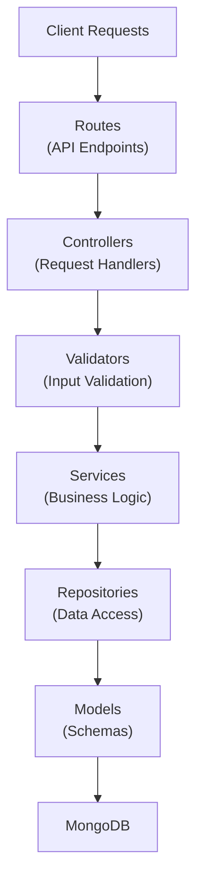
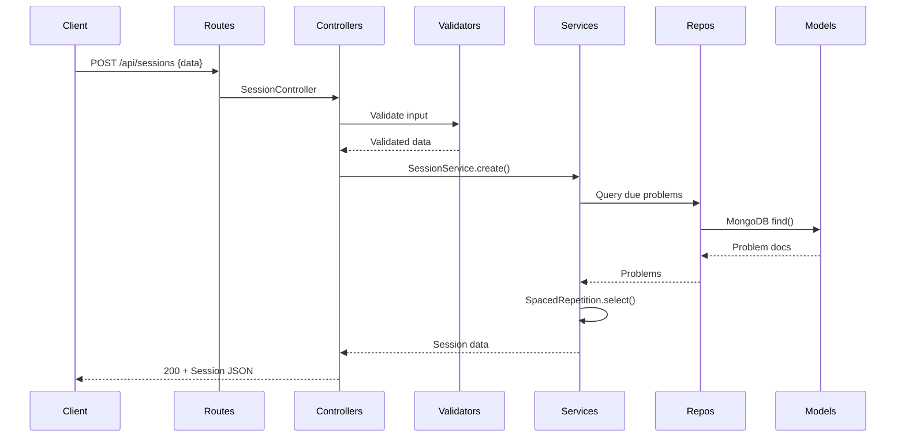

# Server Architecture

## Introduction

The DSA Flashcard server is a Node.js and Express-based REST API that implements a spaced repetition learning platform for Data Structures and Algorithms. It uses MongoDB for persistence and follows a layered repository pattern to maintain clean separation of concerns between API routing, business logic, and data access layers.

## Core Vision & MVP Scope

**Current Phase**: Admin-managed collections with curated DSA sheets (Neetcode 150, Striver A-to-Z, etc.). Users subscribe to collections and review problems via spaced repetition.

**Future Extension**: Community contributions and collection management once user adoption is validated.

**Key Design Principles**:

- Collections as first-class entities (users select which sheets to study)
- Problems can belong to multiple collections (shared across sheets)
- User contributions (new problems) initially limited to admin; later extendable to community
- Start simple, avoid Wikipedia-like complexity (approvals, forks, ownership disputes)
- Filter by company tag within activated collections
- Track user progress per problem independent of collection context

## Architecture Overview

## Layer Responsibilities & Best Practices

### Routes

**Responsibility**: Define API endpoints and mount middleware

**Best Practices**:

- Keep routes thin - delegate to controllers
- Group related endpoints logically
- Apply middleware (auth, validation) at route level
- Use descriptive HTTP verbs (GET, POST, PUT, DELETE)
- Example: `/api/users/:id` → GET retrieves, PUT updates, DELETE removes

### Controllers

**Responsibility**: Handle HTTP requests, parse parameters, orchestrate responses

**Best Practices**:

- Extract request data (body, params, query)
- Call validators on user input
- Invoke services for business logic
- Format and return responses (status codes, JSON)
- Never contain business logic - delegate to services
- Example: `async createSession(req, res)` → validate → call service → respond

### Validators

**Responsibility**: Validate input data and throw errors with proper HTTP status codes

**Best Practices**:

- Reuse field validators across different models
- Throw custom error classes (ValidationError, AuthenticationError, etc.)
- Validate at controller level BEFORE calling services
- Include helpful error messages with field names
- Example: `validateUserCreation()` checks email format, password strength, required fields

### Services

**Responsibility**: Implement business logic and orchestrate repositories

**Best Practices**:

- Contain all business rules (algorithms, calculations, workflows)
- Call repositories for data, never query database directly
- Can call other services if needed
- Throw domain-specific errors
- Keep methods focused and single-purpose
- Example: `SessionService.create()` selects problems via SpacedRepetitionService, calls ProblemRepository, creates session

### Repositories

**Responsibility**: Abstract all database operations for one entity

**Best Practices**:

- One repository per model/entity
- Provide clean query methods (find, create, update, delete)
- Use Mongoose operations, hide query complexity
- Optionally add convenience methods (incrementTotalReviews, updateStats)
- Never leak database details to services
- Example: `userRepository.incrementReviewAndUpdateStreak()` is atomic (single DB call)

### Models

**Responsibility**: Define schemas, validation rules, and data structure

**Best Practices**:

- Define all field types, defaults, and constraints
- Add indexes for frequently queried fields
- Use timestamps for audit trails
- Enforce data integrity at schema level (unique, required, enum)
- Keep schemas focused - one model per entity
- Example: User model has unique email index, enum difficulty for problems

### Error Handler Middleware

**Responsibility**: Catch errors and format responses consistently

**Best Practices**:

- Centralize error handling - one middleware catches all
- Map custom errors to HTTP status codes
- Return consistent error JSON (message, status, field)
- Log errors for debugging
- Never expose internal errors to client
- Example: ValidationError (400) vs NotFoundError (404) vs ConflictError (409)

## Data Flow Example

## Data Models

### User Model

See [src/models/User.js](../src/models/User.js)

Core user entity with authentication and personalization data:

- **Credentials**: email (unique), passwordHash
- **Profile**: name, avatarUrl
- **Preferences**: dailyGoal (default: 20), maxSessionSize (default: 10)
- **Stats**: totalReviews, streak, lastActiveDate
- **Timestamps**: createdAt, updatedAt (auto-managed by Mongoose)

### Problem Model

See [src/models/Problem.js](../src/models/Problem.js)

Represents DSA problems with metadata:

- **Content**: title, description
- **Classification**: difficulty (easy/medium/hard), tags, companies
- **Source**: source (e.g., LeetCode), sourceId, createdBy
- **Indexes**: (source + sourceId) for uniqueness, difficulty & tags for queries

### UserProblemState Model

See [src/models/UserProblemState.js](../src/models/UserProblemState.js)

Tracks individual user progress on problems using SM-2 spaced repetition algorithm:

- **Relationships**: userId, problemId (both required references)
- **Status**: new → learning → review → mastered
- **SM-2 Fields**: easeFactor (1.3–∞), interval (days), repetitions
- **Scheduling**: lastReviewedAt, nextReviewAt (computed by SpacedRepetitionService)
- **Feedback**: lastResult (again/hard/good/easy), lapseCount, revisionNotes
- **Indexes**: (userId + problemId) for uniqueness, (userId + nextReviewAt) for due queries

### Other Models

- **Collection** - Problem groupings/categories
- **UserCollection** - User's subscribed collections
- **ProblemContent** - Detailed problem solutions & approaches

## Validation & Error Handling

### Error Classes

See [src/validators/](../src/validators/) or refactor plan: [docs/validators_refactor_plan.md](./validators_refactor_plan.md)

Custom exceptions with HTTP status codes:

- **ValidationError** (400) - Field validation failures
- **AuthenticationError** (401) - Auth failures
- **NotFoundError** (404) - Resource not found
- **ConflictError** (409) - Duplicate entries

### Field & Model Validators

Reusable validators for common fields (email, password, name, dailyGoal, maxSessionSize, preferences)

Composed validators for entity-level validation:

- User: validateUserCreation(), validateUserUpdate()

### Error Handling Middleware

See [src/middleware/errorHandler.js](../src/middleware/errorHandler.js)

Centralized error catching and response formatting. Converts custom errors to JSON responses with appropriate HTTP status codes.

## ProblemService Architecture

### Service Responsibilities

ProblemService handles global problem content management with clear separation of concerns:

- **Content Management**: createProblem, getProblem, listProblems
- **Metadata Updates**: updateProblemMetadata (title, description, difficulty, tags, companies)
- **Content Updates**: updateProblemContent (solutions, versioning)
- **Deletion**: deleteProblem (with safety checks)

### Validation Layer

ProblemService uses a dedicated ProblemValidator module ([src/utils/problemValidator.js](../src/utils/problemValidator.js)) for:

- **Input Validation**: title, description, difficulty, source, sourceId
- **Solution Validation**: max 10 solutions, required fields, payload size limits
- **Code Snippet Validation**: language, code, max 10000 chars per snippet
- **Normalization**: solution ordering, default values

### API Design

Split endpoints for clear separation:

- `PUT /api/problems/:problemId/metadata` - Update problem metadata
- `PUT /api/problems/:problemId/content` - Update problem solutions
- `GET /api/problems` - Lightweight list (no description)
- `GET /api/problems/:problemId` - Full details with solutions

### Cross-Domain Separation

ProblemService has no dependency on UserProblemState or user-specific state. Deletion safety checks are handled at a higher layer (not in ProblemService itself).

### Transactional Thinking

ProblemService.createProblem has manual rollback: if content creation fails, the problem is deleted to prevent orphan data.

